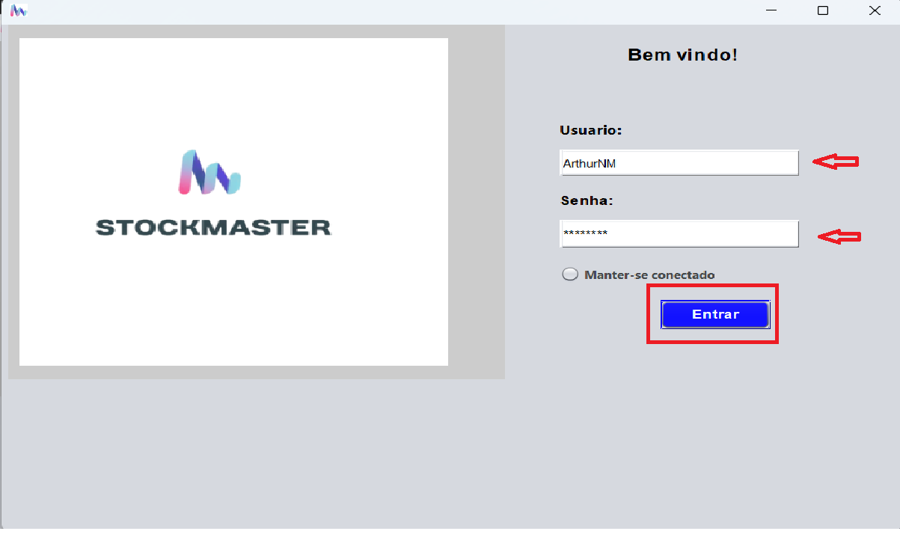
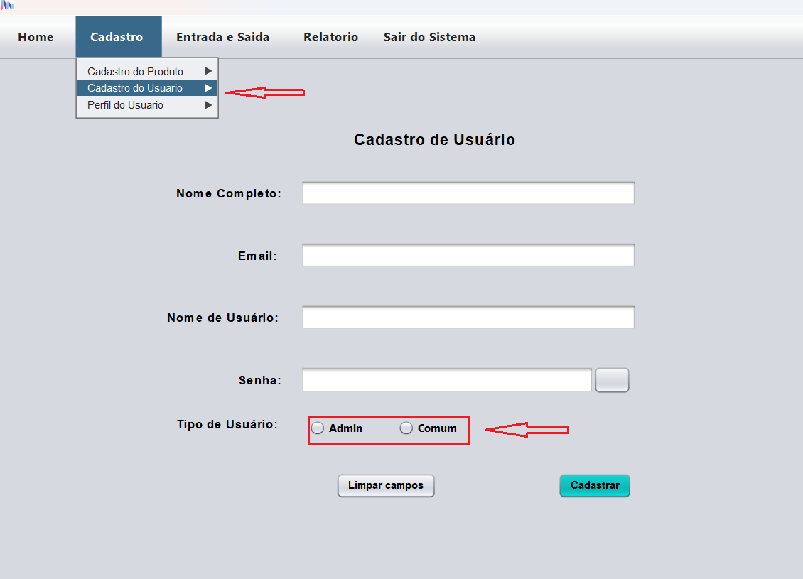

# StockMaster
O sistema de almoxarifado é um aplicativo desktop desenvolvido em Java,
projetado para gerenciar de forma simples e eficiente os estoques de um
almoxarifado. O sistema é acessado por meio de login e senha, garantindo a
segurança dos dados. Ele oferece uma interface intuitiva, com funcionalidades
básicas, mas essenciais, como cadastro de produtos, gerenciamento de
requisições e opções de configuração.

## Tela de Login

 Nessa primeira tela o usuário já cadastrado no sistema fará o login através do seu nome de usuario e a senha,  clicando
no botão "Entrar", o que o levará para tela principal do sistema(telahome).

## Tela principal (telahome)

Para o cadastro no sistema, existem dois tipos de usuários, o usuário tipo adm e o usuário comum, por questões de segurança, as funcionalidades 
de cadastro de usuário e perfil de usuário estão disponíveis apenas para o usuário adm. Na imagem abaixo estamos usando como exemplo um usuário adm.

Na tela princical estão listados no menu superior todas as funções disponíveis, sendo elas : Cadastro de produto, cadastro de usuário, perfil do usuário, entrada e saída de produtos, relatório, e sair do sistema. Cada botão ao ser clicado leva à sua respecutiva funcionalidade. Na parte inferior contém uma tabela onde estão listados todos os produtos cadastrados no sistema e o estoque mínimo e máximo de cada produto.

## Tela Cadastro de produtos

Na tela cadastro de produtos, o usuário irá inserir todas as informações requeridas nos campos, e irá carregar uma imagem do produto clicando no botão "buscar foto", sendo que caso carregue a imagem errada ela pode ser retirada clicando no botão "Limpar foto". Quando todos os campos estiverem preenchidos corretamente o usuário irá clicar no botão "Cadastrar" e o produto será cadastrado no sistema.

## Tela Cadastro de Usuário

Essa funcionalidade estará disponível apenas para o usuário tipo adm.

Para o cadastro de usuário serão preenchidos os campos acima, sendo eles: Nome, email, nome de usuário, qua não poderá ser igual ao nome de outro usuário já cadstrado no sistema; senha, que será mostrada ou ocultada, clicando no botão "ocultar/mostrar" do lado do campo senha; e por último, a definição se o usuário que está sendo cadastrado será do tipo adm ou comum, sendo possível selecionar apenas uma opção. Caso o usuário tenha prenchido algum ou todos os campos incorretamente ele pode simplesmente limpar os campos clicando no botão "Limpar campos". Quando todos os campos estiverem preenchidos corretamente, o usuário irá clicar no botão "Cadstrar" e o novo usuário será cadstrado no sistema, gerando uma mensagem de Sucesso e um código de usuário que será mostrado na tela ao final do cadastro.

## Tela Perfil do Usuário

Essa funcionalidade estará disponível apenas para o usuário tipo adm.

  

Nessa tela estarão listados todos os usuários do sistema. O usuário tipo adm irá clicar no usuário listado na tabela na parte inferior e os dados serão listados nos respectivos campos, então o usuário adm poderá alterar os dados ou até mesmo mudar o tipo de usuário para adm ou comum, conforme necessisdade. Ao alterar algum dado as alterções serão confirmadas ao clicar no botão "Atualizar". O usuário adm poderá excluir o cadastro completo selecionando o usuário e clicando no botão "Excluir conta".

## Tela Entrada e Saída de produtos

A tela entrada e saída de produtos fará a movimentação do estoque, realizando a entrada ou saída do estoque de produtos que já estejam cadstrados anteriormente na tela cadastro de produtos. O usuário irá digitar o código do produto ou o nome e clicar no "Enter" do seu pc, então caso o produto esteja cadastrado no sistema ele será listado na tabela inferior, e ao clicar no produto na tabela is campos de nome do produto, código, categoria e unidade de medida serão preenchidos automaticamente, então o usuário irá selecionar a quantidade de produtos. Ao clicar no botão "Mov.Estoque" o produtos e a quantidade será adicionado ou retirado do estoque conforme a seleção de entrada ou saída na parte superior direira da página, lembrando que será possível selecionar apenas uma opção.

## Tela de relatórios

Nessa tela o usuário comum poderá visualizar as requisições de entrada e saída do estoque, e o usuário adm poderá aprovar ou reprovar a requisição de entrada e saída de estoque que estará como "Pendente"(conforme mostra a imagem acima). Ambos usuários poderão gerar um documento no formato pdf automaticamente quando ao clicar no botão "Gerar pdf"

 Feito isso, será gerado um relatório no formato pdf que poderá ser salvo em um drive externo, enviado por email, whatsapp ou qualquer outro meio eletrônico, conforme a necessidade do usuário.

 ## Sair do Sistema

Para o usuário sair do sistema, ele deverá clicar na função no menu principal da tela home, "Sair do Sietema", então irá aparecer uma mensagem de confirmação que perguntará se o usuário logado realmente deseja sair do sistema, caso clique no "Não" a caixa de mensagem irá desaparecer, caso clique no "Sim" o usuário será deslogado do sistema e será direcionado novamente para tela de login.

